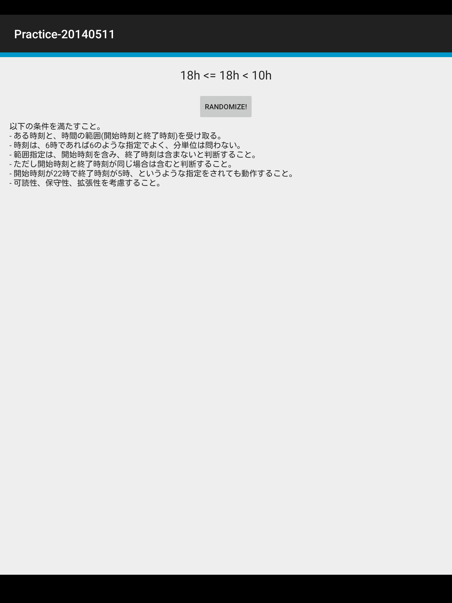

# Practice-20140511



## Practice

以下の条件を満たすこと。

- ある時刻と、時間の範囲(開始時刻と終了時刻)を受け取る。
- 時刻は、6時であれば6のような指定でよく、分単位は問わない。
- 範囲指定は、開始時刻を含み、終了時刻は含まないと判断すること。
- ただし開始時刻と終了時刻が同じ場合は含むと判断すること。
- 開始時刻が22時で終了時刻が5時、というような指定をされても動作すること。
- 可読性、保守性、拡張性を考慮すること。

## Testing

``` sh
### androidTest
./gradlew connectedAndroidTestDebug

### unit test
./gradlew testDebug

### take screenshots
./gradlew clean spoon
open app/build/spoon/debug/index.html
```

## Contribute

プロジェクト構成に関する特記すべき事項は [CONTRIBUTING.md](CONTRIBUTING.md) を参照

## Links

- [ichigotake/Practice-20140511](https://github.com/ichigotake/Practice-20140511)
